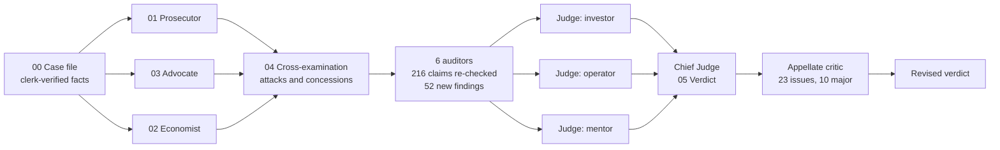

# The Market v. Inlet

A structured trial of one question: **will Inlet sell, and should its author keep building it?**

A Prosecutor argued it won't. A neutral Economist priced it. An Advocate made the strongest honest case for it. The two sides then cross-examined each other. Finally a bench of 12 agents re-checked the evidence, three judges ruled blind to each other, and a Chief Judge delivered the verdict, which an appellate critic then attacked.

Everything below was checked against this repository and the live site on **2026-09-28**.

---

## The verdict in 30 seconds

> **PIVOT.** Stop selling Inlet to strangers as a self-serve SaaS. Keep the engine: it already carries real leads for the author's own client sites. It becomes the lead back-office of his own web studio, billed as a line in his client retainers. One resale test to agencies that hand-code their clients' sites is allowed, with numeric gates on **2026-10-28**, **2026-11-27** and **2026-12-27**, and no extension.

| | Score |
|---|---|
| Panel vote | PIVOT 2 (investor, mentor) · NARROW & CONTINUE 1 (operator) · KILL 0 · GO AS IS 0 |
| The idea's potential (best version, executed) | **43 / 100** |
| The product today | **18.75 / 100** |
| Distance to "sellable to a stranger" | **12.5%** of the way (1.25 of 10 gates) |
| Prosecution · Economist · Defense (/10) | **7.5 · 7.5 · 5.5** |

**The six facts that decided it**
1. **No stranger could ever have succeeded.** Self-serve forms are created with no allowed origins, and customers have no screen to add one, so every browser submission gets a 403 (`app/api/client/forms/route.ts:124-134`, `migrations/schema.sql:23`). "No users" is a broken funnel, not proof of no demand.
2. **Nobody can pay.** Every paid button is a `mailto:` (`lib/upgrade.ts`), and there are no legal pages, no legal entity and no DPA.
3. **Delivery breaks provider terms.** It rotates several free Brevo accounts, although Brevo §3.1 allows one per user, and it sends lead text to free Gemini keys, whose terms say not to send personal data.
4. **Leads are silently lost.** A substring filter drops any lead containing "seo" (a studio in Seoul, a French request for SEO work, an email address such as "joseortiz@…"), and the anti-spam writes permanent IP bans.
5. **Cost is not the problem.** Every paid plan keeps a 37–88% margin on paid infrastructure, and honest email costs $20–69 a month.
6. **The only production user is the author,** through his own client sites. That is why the ruling is PIVOT and not KILL.

Nine orders apply **immediately, whatever the verdict** (§5a of `05-verdict.md`), all due by 2026-10-19. The first four:
- stop dropping leads;
- end permanent bans;
- close the `/api/download` SSRF;
- stop sending personal data to free AI keys.

---

## Reading order

| # | File | Seat | What's inside | Size |
|---|---|---|---|---|
| 00 | [`00-case-file.md`](00-case-file.md) | Clerk | 15 verified facts, roles, rules of evidence | ≈ 1.3k words |
| 01 | [`01-prosecution.md`](01-prosecution.md) | ⚔️ Prosecutor | 13 severity-ranked counts, 2026 competitor lineup, 4 buyer walk-throughs, 13 dropped charges | ≈ 5.8k |
| 02 | [`02-economist.md`](02-economist.md) | 💰 Economist | Unit economics, funnel maths, Bear/Base/Bull MRR, payment rails, 7 business models ranked, the deciding metric | ≈ 6.1k |
| 03 | [`03-defense.md`](03-defense.md) | 🛡️ Advocate | 8 exhibits of strength, pre-emptive rebuttals, positioning, 10-move upgrade plan, 30/60/90 | ≈ 6.7k |
| 04 | [`04-cross-examination.md`](04-cross-examination.md) | 🔁 Both sides | Attacks, concessions, a table of what moved | ≈ 5.6k |
| 05 | [`05-verdict.md`](05-verdict.md) | ⚖️ Bench | Evidence audit, 22 new findings, scorecards, disputes settled, orders, gates, dissent | ≈ 10k |

Short on time? Read the top of `05-verdict.md` (the ruling, in English and French), then its §5 (the orders).

---

## How the trial was run

The trial was built so that no single agent's opinion could carry it:
- **Blind openings.** The three opening briefs were written in parallel, and no party saw another's draft before cross-examination, so none could anchor on the others.
- **Evidence rules.** Every claim cites `file:line` or a URL. A claim without a source was tagged `[UNVERIFIED]` and given no weight.
- **Independent audit.** Two code auditors, a market and legal auditor, an arithmetic auditor (who re-ran the Economist's scenarios in scripts, to the cent) and two hunters checked 216 claims. The hunters had one job: find what every party missed.
- **A blind panel.** Three associate judges scored the idea on 8 weighted dimensions without seeing each other's rulings.
- **Appellate review.** A critic attacked the Chief Judge's draft and raised 23 issues, 10 of them major: an arithmetic basis, contradictory gates, and inferences that had been stated as facts. The Chief Judge re-verified each one and applied all 23, seven of them with further corrections.
- **Read-only on production.** No agent signed up, submitted a form or triggered an email on the live service.

---

## What moved during the trial

| Point | Opening | Final ruling |
|---|---|---|
| Self-serve 403 (Count 2) | Prosecution: fatal | **Upheld, decisive.** Conceded by the Defense |
| Email capacity (Count 3) | Prosecution: fatal | **Severe on economics**, but the terms breach is an immediate order |
| "The only form backend that speaks French" | Defense: exhibit | **Struck.** Jotform has a full French site |
| "The agency-portal wedge is unoccupied" | Defense: exhibit | **Struck.** Agency Label and Duda occupy it |
| "Every email carries the end-client's brand" | Defense: top exhibit | **Struck.** Branding is per tenant, not per end-client |
| Probability-weighted MRR at month 12 | Economist: $215 | **Reframed.** Conditional on the author committing: about **$230–320**, i.e. $3–5 an hour for his time over 24 months |
| "The author's agency is customer #1" | Economist and Defense | **Unproven.** The real customer #1 is the author's own studio |

---

## Evidence scope (read this if you reuse the dossier)

The Chief Judge's auditors went further than this repository. The author reviewed each piece afterwards and applied one rule: **keep it only if the verdict depends on it.**

| Outside evidence | Role in the verdict | Kept? |
|---|---|---|
| The author's own public client-site repositories: his sites post leads to Inlet through a server relay he wrote | **Decisive.** It is why the ruling is PIVOT, not KILL | **Kept**, marked ◆. Client names, domains, towns and repository names withheld |
| The same relay can lose leads to a permanent IP ban and keeps no copy | **Decisive** for immediate order A2 | **Kept**, marked ◆, anonymised |
| New repositories on the author's public profile during the 51 "silent" days | Softens the founder-signal count | **Kept**, generic |
| A third-party organisation's repositories and internal audit | Only reinforced "customer #1 is unproven", which in-repo evidence already shows (the agency's documented deployment returns 404) | **Removed** |
| A company-registry lookup of a same-name company whose president is not the author | The court itself rated it "name match only", with no weight | **Removed** |
| Inferences about the author's country (phone prefix, commit time zone) | Fed only conditional payment-rail advice | **Removed** at the author's request. The rails are now stated as conditional on where the legal entity is registered |

The repository copies made during the audit were deleted after the trial. Removing this material changed no score and no order.

**Author's statement (2026-09-28):** Inlet is meant to launch in several regions, including Europe and the US. How that relates to the orders is set out in the clerk's note at the end of `05-verdict.md`.

---

## Limits

- **Unseen production state.** The production database (real signups, plans, lead volumes), the production AI keys and the number of SMTP accounts in use were not visible. Findings about them rest on code and commit history, and are tagged as such.
- **Judgment, not measurement.** P(bear | commit) = 0.40 is the court's judgment. The court sets out what evidence would move it (§7 of the verdict).
- **The house calibration applies to this dossier too.** The Chief Judge self-assessed the ruling at about 70%, which counts as 14%. The gates in §5(c) exist so that reality, not this document, gets the last word.

---

## Résumé en français

**Verdict : PIVOT.** Cessez de vendre Inlet à des inconnus en libre-service, mais gardez le moteur : il transporte déjà de vrais leads pour les sites clients de l'auteur. Inlet devient le back-office de suivi des demandes de son propre studio, facturé comme une ligne de ses contrats de maintenance. Un seul test de revente aux agences qui codent leurs sites à la main est autorisé, avec des seuils chiffrés au 28 octobre, au 27 novembre et au 27 décembre 2026, sans prolongation.

**Scores :** potentiel de l'idée 43/100, produit actuel 18,75/100, soit 12,5 % du chemin vers « vendable à un inconnu ».

**Neuf ordonnances immédiates**, à exécuter quel que soit le verdict, toutes avant le 19 octobre. Les quatre premières :
- ne plus jeter de leads ;
- lever les bannissements définitifs ;
- fermer la faille SSRF de `/api/download` ;
- ne plus envoyer de données personnelles aux clés Gemini gratuites.
